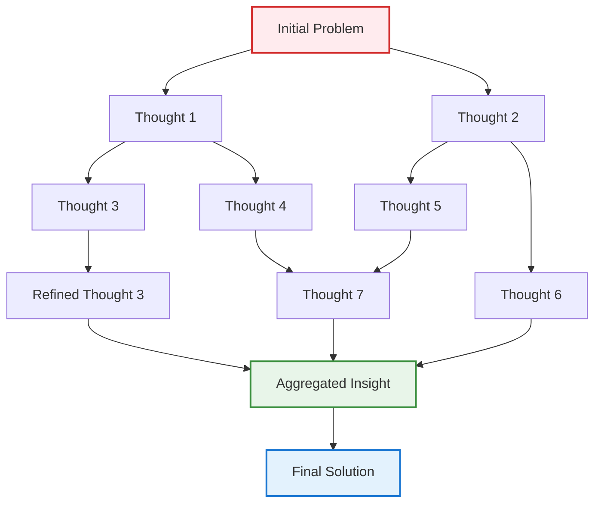

## Problem

Linear reasoning approaches like Chain-of-Thought (CoT) and even tree-based methods like Tree-of-Thoughts (ToT) have limitations when dealing with problems that require complex interdependencies between reasoning steps. Many real-world problems involve reasoning paths that merge, split, and recombine in ways that don't fit neatly into linear or tree structures. These problems need a more flexible approach that can represent arbitrary relationships between thoughts.

## Solution

Graph of Thoughts (GoT) extends reasoning frameworks by representing the thought process as a directed graph. GoT provides a general framework that subsumes Chain-of-Thought (linear) and Tree-of-Thoughts (branching) as special cases, with aggregation as the key enabling operation.

In GoT:

- **Nodes** represent individual thoughts or reasoning states
- **Edges** represent transformations or reasoning steps between thoughts
- **Multiple paths** can lead to and from each node
- **Aggregation operations** can combine multiple thoughts
- **Backtracking** allows revisiting and refining previous thoughts

This enables operations like:
1. **Branching**: Generate multiple thoughts from one
2. **Aggregation**: Combine insights from multiple reasoning paths
3. **Refinement**: Improve thoughts based on later insights
4. **Looping**: Revisit and refine thoughts iteratively

## Example

```python
class GraphOfThoughts:
    def __init__(self, llm, max_thoughts=50):
        self.llm = llm
        self.max_thoughts = max_thoughts
        self.thought_graph = nx.DiGraph()
        self.thought_scores = {}
        
    def solve(self, problem):
        # Initialize with root thought
        root = self.generate_initial_thought(problem)
        self.add_thought(root, score=1.0)
        
        # Iteratively expand the graph
        while len(self.thought_graph) < self.max_thoughts:
            # Select promising thoughts to expand
            thoughts_to_expand = self.select_thoughts_for_expansion()
            
            for thought in thoughts_to_expand:
                # Generate new thoughts through different operations
                self.branch_thought(thought, problem)
                self.aggregate_related_thoughts(thought)
                self.refine_thought(thought, problem)
        
        # Find best solution path through the graph
        return self.extract_best_solution()
    
    def aggregate_related_thoughts(self, thought):
        """Combine insights from multiple related thoughts"""
        related = self.find_related_thoughts(thought)
        
        if len(related) >= 2:
            prompt = f"""
            Combine insights from these thoughts:
            {[t.content for t in related]}
            
            Create a unified thought that incorporates the best of each:
            """
            aggregated = self.llm.generate(prompt)
            new_thought = Thought(aggregated)
            self.add_thought(new_thought)
            
            for source in related:
                self.add_edge(source, new_thought, operation='aggregate')
```



## Benefits

- **Flexibility**: Can represent complex, non-linear reasoning patterns
- **Reusability**: Thoughts can be referenced and built upon multiple times
- **Robustness**: Multiple paths to solution increase success probability
- **Insight Aggregation**: Combines best aspects of different reasoning paths

## Trade-offs

**Pros:**
- Handles complex problems with interdependent reasoning steps
- Can discover non-obvious connections between ideas
- Supports iterative refinement and backtracking
- More expressive than linear or tree-based approaches

**Cons:**
- Significantly higher computational cost (5-20x vs. linear reasoning)
- Complex to implement and debug
- May generate many redundant thoughts
- Requires sophisticated scoring and path-finding algorithms
- Can be overkill for simple problems

## How to use it

Use for complex problems where multiple solution approaches need to be merged or where early decisions may need revision based on later insights. LangGraph provides native support for GoT-like workflows with cycles and backtracking.

Use simpler approaches (CoT, ToT) for:
- Straightforward problems with single viable solution paths
- Cases where computational resources are limited
- Problems where reasoning branches don't need to recombine

## References

- [Graph of Thoughts: Solving Elaborate Problems with Large Language Models (AAAI 2024)](https://arxiv.org/abs/2308.09687) - Besta et al., ETH Zurich
- [Code Implementation](https://github.com/spcl/graph-of-thoughts)
- [LangGraph - Graph-based Agent Workflows](https://www.langchain.com/langgraph)

---
