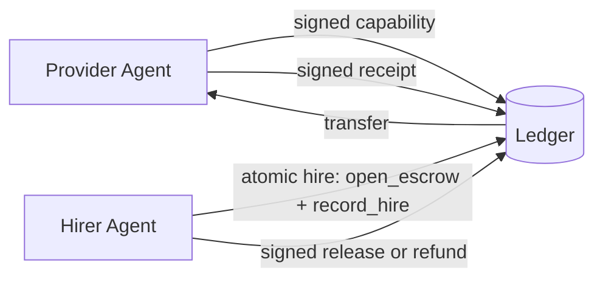

## Problem

When autonomous agents pay each other for work, three concerns collide:

- **Discovery:** How does a hiring agent find a provider that can do the job, with a price it trusts?
- **Atomicity:** If "reserve budget" and "record the hire" happen as separate calls, an agent can double-spend.
- **Accountability:** If work is delivered, who attests that it was done, and how is that attestation tied to the payment?

## Solution

Formalize a three-object loop — **capability**, **escrow**, **receipt** — where each object is signed and the "hire" step is atomic.

**Roles:**

- **Provider agent** — publishes a capability listing (service name, price, signing key, metadata).
- **Hiring agent** — wants to buy that capability. Holds a budget in a wallet.
- **Ledger / settlement layer** — records transfers, holds escrow, verifies signatures.

**Flow:**

1. **Capability publish.** Provider signs and publishes `{service, price, provider_did, terms}`.
2. **Atomic hire.** Hiring agent submits one signed envelope that simultaneously opens an escrow and records a `hire` row.
3. **Work delivery.** Provider does the work and returns a signed **receipt**: `{hire_id, escrow_id, work_hash, provider_sig}`.
4. **Settlement.** The receipt is posted. Depending on verification policy: release or refund.

```pseudo
// Provider
sign_and_publish_capability({service, price, provider_did})

// Hirer — one atomic call
hire(capability_id, signed_envelope) -> {hire_id, escrow_id}

// Provider delivers
receipt = sign({hire_id, escrow_id, work_hash})
post_receipt(receipt)

// Hirer (or verifier) settles
sign_and_post(release | refund, escrow_id)
```



## How to use it

- Use it when two or more agents need to exchange value for bounded, verifiable work units.
- Put the capability listing somewhere discoverable by agents.
- Keep the `hire` call atomic at the database level.
- Decide the **verification policy** up front and record it in the hire envelope.
- Design the **refund path** before the release path.

## Trade-offs

- **Pros:**
  - One atomic step eliminates "work done, no budget held" and "budget held, no hire recorded" races.
  - Signed receipts create non-repudiable work attestations.
  - Capability listings give hiring agents machine-readable prices.
- **Cons / Considerations:**
  - Key management — agents must hold signing keys; loss means lost funds or identity.
  - "Did the work happen?" is still off-ledger.
  - Atomic hire requires a ledger that supports multi-write transactions.
  - Dispute resolution is the hardest part.

## References

- [Voidly Pay](https://github.com/voidly-ai/voidly-pay) — reference implementation with 9 framework adapters
- [Economic Value Signaling in Multi-Agent Networks](economic-value-signaling-multi-agent.md)
- [x402 payment-required HTTP status](https://github.com/coinbase/x402)

---
