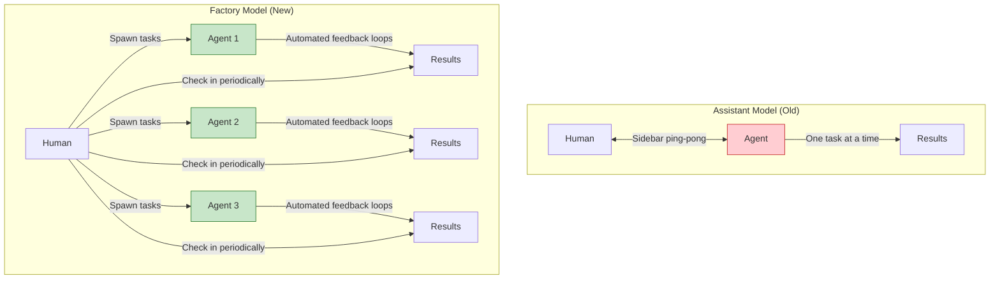

## Problem

The "assistant" model—working one-on-one with an agent in a sidebar, watching it work, ping-ponging back and forth—limits productivity and scalability. As models become more autonomous and capable, the human becomes the bottleneck as the feedback loop. You can only run one agent at a time when you're watching it in a sidebar.

## Solution

Shift from the **assistant model** to the **factory model**: spawn multiple autonomous agents that work in parallel, check on them periodically, and focus your time on higher-level orchestration rather than being the feedback loop.

**The factory mindset:**
- Send off multiple agents to work on different tasks
- Check in on them periodically (30-60 minutes later)
- Focus on setting up automated feedback loops (tests, builds, skills)
- Optimize for parallelism and autonomy



**The evolution:**

| Stage | Model | Human Role | Agent Behavior |
|-------|-------|------------|----------------|
| **Past** | Assistant | Watch everything, provide feedback | Frequent check-ins, interactive |
| **Present** | Hybrid | Set up automated loops | Mixed interactive and autonomous |
| **Future** | Factory | Orchestrate and review | Fully autonomous, minimal human contact |

## How to use it

**Transitioning from assistant to factory:**

**1. Shift your time investment:**

```yaml
# Assistant model (old)
time_distribution:
  watching_agent_work: 80%
  actual_development: 20%

# Factory model (new)
time_distribution:
  setting_up_automated_loops: 30%
  spawning_and_orchestrating: 20%
  review_and_integration: 50%
```

**2. Build automated feedback loops:**

Instead of being the feedback loop yourself, set up:
- Test commands that agents run automatically
- Build commands that verify correctness
- Skills that encapsulate common operations
- Linters and formatters that agents use

**3. Use appropriate models for each mode:**

- **Interactive mode**: Use "trigger happy" models for quick tasks
- **Factory mode**: Use "lazy" research-oriented models for autonomous work

**4. Embrace asynchronous workflows:**

```pseudo
# Old workflow (assistant)
user → agent → user → agent → user → agent → result

# New workflow (factory)
user → spawn(agent1) + spawn(agent2) + spawn(agent3)
→ do something else
→ check back later
→ integrate results
```

## Trade-offs

**Pros:**

- **Massive parallelization**: Run multiple agents simultaneously
- **Better use of human time**: Focus on orchestration, not watching
- **Scales with model capability**: More autonomous models = more effective factory
- **Reduced latency**: Don't wait for agent to finish each step

**Cons:**

- **Loss of control**: Can't steer agent in real-time
- **Delayed feedback**: Might not see issues for 30-60 minutes
- **Setup overhead**: Requires robust automated feedback loops
- **Harder to debug**: Less visibility into agent process

## References

* [Raising an Agent Episode 9: The Assistant is Dead, Long Live the Factory](https://www.youtube.com/watch?v=2wjnV6F2arc) - AMP (Thorsten Ball, Quinn Slack, 2025)
* [Communicative Agents for Software Development (OpenDevin)](https://arxiv.org/abs/2407.16819) - Wang et al., 2024
* [AutoGen: Enabling Multi-Agent LLM Applications](https://arxiv.org/abs/2308.08160) - Duan et al. (Microsoft Research), 2023

---
