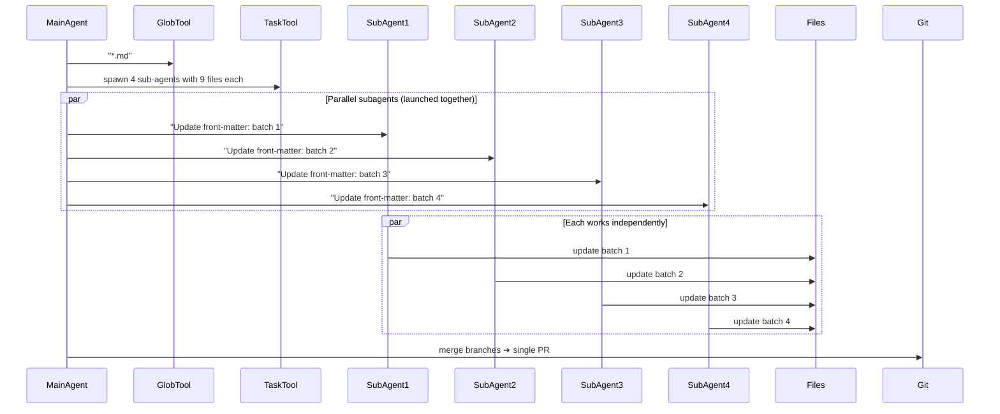

## Problem

Large multi-file tasks blow out the main agent's context window and reasoning budget. You need a way to delegate work to specialized agents with isolated contexts and tools.

## Solution

Let the main agent **spawn focused sub-agents**, each with its own fresh context, to work in parallel on shardable subtasks. Aggregate their results when done.

**Critical requirement**: Each subagent invocation must have a clear, specific task subject for traceability. Empty or generic subjects make parallel work untraceable and synthesis difficult.

**Implementation approaches:**

### 1. Declarative YAML Configuration

Define subagent types in configuration files with their own system prompts, allowed tools, and context windows:

```yaml
# subagents/planning.yaml
name: planning
system_prompt: "Break down complex tasks into steps..."
tools:
  - list_files
  - read_file
  # or inherit: all (from parent agent)
```

Agents invoke subagents via a dedicated tool:

```pseudo
subagent(agent_name, prompt, files)
```

### 2. Dynamic Spawning

Spawn subagents on-demand for parallel task execution:

```pseudo
# Main agent creates todo list
files = glob("**/*.md")
batches = chunk(files, 9)

# Spawn subagents for each batch IN PARALLEL
for batch in batches:
    spawn_subagent(
        task="Update YAML front-matter in markdown files",  # Clear, specific subject
        files=batch,
        context=instructions
    )
```

## Example (YAML front-matter refactor)



## How to use it

**Use cases for subagents:**

1. **Context window management**: Process large files in subagents without polluting main context
2. **Concurrent work**: Run multiple subagents in parallel, join on completion
3. **Code-driven LLM invocation**: Hand off control to LLM for specific determination
4. **Security isolation**: Separate tools/contexts in mutually isolated subagents

**Three spawning architecture scales:**

- **Virtual File Isolation** (2-4 subagents): Same-process spawning with explicit file passing for context management
- **Git Worktree Isolation** (10-100 subagents): Filesystem-level isolation using git worktrees for code migrations
- **Cloud Worker Spawning** (100+ agents): Container/VM isolation for enterprise-scale distributed processing

**Production implementations:**

- **Cursor AI**: Hierarchical spawning (Planner → Sub-Planners → Workers) with hundreds of concurrent agents
- **GitHub Agentic Workflows**: Event-driven agent spawning within CI infrastructure
- **Anthropic Claude Code**: Users with high-volume workflows achieve 10x+ speedup on framework migrations

## Trade-offs

**Pros:**

- **Context isolation**: Each subagent has clean context window
- **Parallelization**: Reduce workflow latency through concurrent execution
- **Specialization**: Different subagent types for different tasks
- **Virtual files**: Precise control over what each subagent can see
- **Tool scoping**: Limit subagent capabilities for security/simplicity

**Cons:**

- **Overhead**: Spawning and coordinating subagents adds complexity
- **Cost**: Running multiple agents simultaneously increases token usage
- **Coordination**: Main agent must track and aggregate subagent results
- **Not always necessary**: Author notes "frequently thought we needed subagents, then found more natural alternative"

## References

* [SKILLS-AGENTIC-LESSONS.md](https://github.com/nibzard/SKILLS-AGENTIC-LESSONS) - Analysis of 88 sessions emphasizing clear task subjects and parallel delegation patterns
* Vezhnevets, A., et al. (2017). [Feudal Networks for Hierarchical Reinforcement Learning](https://arxiv.org/abs/1706.06121). ICML.
* [Building Companies with Claude Code](https://claude.com/blog/building-companies-with-claude-code) - Ambral's "robust research engine" uses dedicated sub-agents
* [Building an internal agent: Subagent support](https://lethain.com/agents-subagents/) - Will Larson on YAML-configured subagents
* [Cursor: Scaling long-running autonomous coding](https://cursor.com/blog/scaling-agents) - Hierarchical spawning with hundreds of concurrent agents

---
