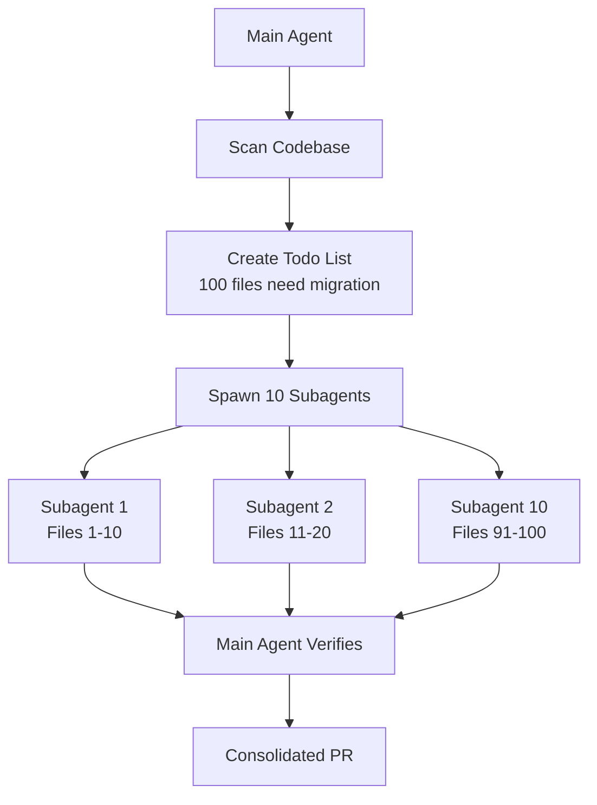

## Problem

Large-scale code migrations are time-consuming when done sequentially:

- **Framework upgrades** (e.g., testing library A → testing library B)
- **Lint rule rollouts** across hundreds of files
- **API migrations** when dependencies change
- **Code modernization** (e.g., class components → hooks)

## Solution

Use a **swarm architecture** where the main agent orchestrates 10-20 parallel subagents working simultaneously on independent chunks of the migration.

**Pattern:**

1. **Main agent creates migration plan**: Enumerate all files/targets needing migration
2. **Create todo list**: Break work into parallelizable chunks
3. **Spawn subagent swarm**: Start 10+ agents concurrently, each taking N items
4. **Map-reduce execution**: Each subagent migrates its chunk independently
5. **Verification**: Main agent validates results, may spawn additional agents for fixes
6. **Consolidation**: Combine results (single PR or coordinated merge)



## How to use it

**Implementation approach:**

```pseudo
# Main agent orchestration
main_agent.prompt = """
1. Find all files matching pattern (e.g., *.test.js using old framework)
2. Create todo list with file paths
3. Divide into batches of 10 files each
4. For each batch, spawn subagent with instructions:
   - Migrate these specific files
   - Follow migration guide at docs/migration.md
   - Run tests after each change
   - Commit if tests pass
5. Monitor all subagents
6. Verify all todos completed
"""

# Spawn swarm
for batch in batches:
    spawn_subagent(
        task=f"Migrate {batch.files} from Framework A to B",
        context=migration_guide,
        auto_commit=True
    )
```

## Trade-offs

**Pros:**

- **Massive parallelization**: 6-10x speedup vs. sequential migration
- **Easy verification**: Each subagent handles tractable chunk
- **Fault isolation**: One subagent failing doesn't break others
- **Cost-effective for scale**: 100x+ ROI despite 10x token cost increase

**Cons:**

- **High token cost**: Running 10+ agents simultaneously
- **Coordination complexity**: Main agent must track all subagents
- **Merge conflicts**: Parallel changes might conflict
- **Requires independence**: Only works if migration targets are separable

**Prerequisites:**

- **Atomic migrations**: Each file can be migrated independently
- **Clear specification**: Migration rules must be unambiguous
- **Good test coverage**: Automated verification of correctness

**When NOT to use:**

- **< 10 files**: Sequential execution is more efficient
- **High coupling**: Files require coordinated changes
- **Complex semantic changes**: Require holistic understanding

## References

* Boris Cherny: "The common use case is code migration. The main agent makes a big to-do list for everything and map reduces over a bunch of subagents. Start 10 agents and go 10 at a time."
* [AI & I Podcast: How to Use Claude Code Like the People Who Built It](https://every.to/podcast/transcript-how-to-use-claude-code-like-the-people-who-built-it)
* [Cursor Blog: Scaling Agents](https://cursor.com/blog/scaling-agents) — Production use with hundreds of concurrent agents

---
