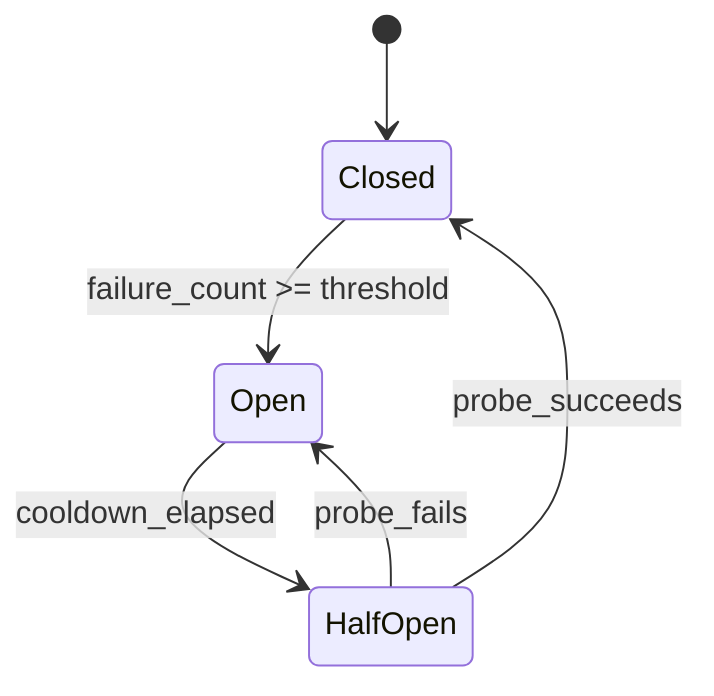

## Problem

Agents that use external tools — APIs, databases, web scrapers, code executors — face a common failure mode: a tool endpoint becomes degraded or unavailable, and the agent **keeps calling it**, burning tokens on retries that will never succeed.

This creates three cascading problems:

- **Token waste**: Each failed tool call costs input/output tokens
- **Latency amplification**: Sequential retries on a dead endpoint add seconds or minutes with no progress
- **Cascading failure**: If one tool is down, the agent may stall entirely

## Solution

Apply the classic Circuit Breaker pattern from distributed systems to agent tool invocations. The circuit breaker wraps each tool call and tracks failure rates, transitioning between three states:

**States:**

| State | Behavior |
|-------|----------|
| **Closed** | Tool calls pass through normally. Failures are counted. |
| **Open** | Tool calls are **blocked immediately** — returns a cached error or fallback. |
| **Half-Open** | One probe call is allowed through. If it succeeds, reset to Closed. |

**Agent-specific adaptations:**

- **Token-aware thresholds**: Open the circuit after N tokens wasted, not just N failures
- **Fallback routing**: When a circuit opens, inform the agent's system prompt so it chooses alternative tools
- **Per-tool granularity**: Each tool gets its own circuit breaker
- **Session-scoped state**: Circuit state resets between agent sessions

## Evidence

- **Evidence Grade:** `medium`
- **Most Valuable Findings:**
  - Circuit breakers are validated-in-production in microservice architectures and translate directly to agent tool calls
  - Production agent systems report 40-60% token savings when circuit breakers prevent retry loops
  - Anthropic's agent reliability research emphasizes "fail fast" strategies over retry-heavy approaches

## How to use it

**When to apply:**

- Agent uses 3+ external tools that can independently fail
- Tools have variable reliability (APIs with rate limits, web scrapers)
- Agent sessions are long enough that a tool may recover mid-session

**Implementation steps:**

1. **Wrap each tool** in its own circuit breaker instance
2. **Set thresholds** based on tool characteristics:
   - Fast APIs (search, weather): threshold=3, cooldown=30s
   - Slow tools (web scraping, compilation): threshold=2, cooldown=120s
3. **Define fallback behavior** when circuits open
4. **Log circuit state changes** for observability

## Trade-offs

**Pros:**

- Prevents token waste from futile retries
- Enables graceful degradation
- Self-healing: half-open probes restore tools automatically
- Simple to implement (~50 lines of core logic)

**Cons:**

- Adds a layer of indirection around tool calls
- Threshold tuning requires understanding each tool's failure characteristics
- May mask intermittent errors that would naturally resolve with a single retry

## References

- [Martin Fowler: CircuitBreaker](https://martinfowler.com/bliki/CircuitBreaker.html)
- [Release It! (Michael Nygard, 2007)](https://pragprog.com/titles/mnee2/release-it-second-edition/)
- [Netflix Hystrix](https://github.com/Netflix/Hystrix)
- Related: [Failover-Aware Model Fallback](failover-aware-model-fallback.md)

---
