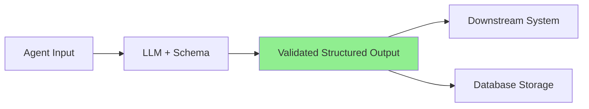

## Problem

Free-form agent outputs are difficult to validate, parse, and integrate with downstream systems. When agents return unstructured text, you face:

- Unpredictable output formats requiring complex parsing
- Difficult validation and error handling
- Brittle integration with automated workflows
- Inconsistent categorization and classification

## Solution

Constrain agent outputs using deterministic schemas that enforce structured, machine-readable results. Instead of allowing free-form text responses, specify exact output formats using type systems, JSON schemas, or framework-specific structured output APIs.

**Core approach:**

**Define explicit output schemas:**

- Use TypeScript interfaces, JSON Schema, or Pydantic models
- Specify required fields, types, and constraints
- Define enumerations for categorical outputs

**Leverage framework structured output APIs:**

- OpenAI's structured outputs with JSON schema (constrained decoding)
- Anthropic's tool use for structured results
- Vercel AI SDK's `generateObject` function
- LangChain's output parsers

**Example implementation:**

```typescript
import { generateObject } from 'ai';
import { z } from 'zod';

const LeadQualificationSchema = z.object({
  qualification: z.enum(['qualified', 'unqualified', 'needs_review']),
  confidence: z.number().min(0).max(1),
  companySize: z.enum(['enterprise', 'mid-market', 'smb', 'unknown']),
  nextSteps: z.array(z.string()),
  reasoning: z.string()
});

const result = await generateObject({
  model: openai('gpt-4'),
  schema: LeadQualificationSchema,
  prompt: `Analyze this lead: ${leadData}`
});
```



## How to use it

**When to apply:**

- Multi-phase agent workflows requiring structured handoffs
- Classification and categorization tasks
- Data extraction and transformation
- Integration with databases or APIs
- Compliance and audit requirements

## Trade-offs

**Pros:**

- **Reliability:** Guaranteed parseable outputs eliminate parsing errors
- **Type safety:** Compile-time checking in typed languages
- **Integration:** Seamless connection to databases, APIs, workflows
- **Security:** Schema validation prevents prompt injection before execution

**Cons:**

- **Rigidity:** Schema changes require coordinated updates
- **Complexity:** Requires upfront schema design effort
- **Framework dependency:** Relies on LLM provider schema support

## References

- [Vercel: What We Learned Building Agents](https://vercel.com/blog/what-we-learned-building-agents-at-vercel)
- [OpenAI Structured Outputs](https://platform.openai.com/docs/guides/structured-outputs)
- [JSONformer: A Structural Generation Framework for JSON](https://arxiv.org/abs/2306.05659)

---
