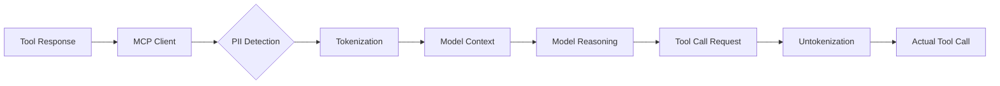

## Problem

AI agents often need to process workflows involving personally identifiable information (PII) such as emails, phone numbers, addresses, or financial data. However, sending raw PII through the model's context creates privacy risks and compliance concerns.

## Solution

Implement an interception layer in the Model Context Protocol (MCP) client that automatically tokenizes PII before it reaches the model, and untokenizes it when making subsequent tool calls.

**Architecture:**

**Flow:**

1. **Interception**: When tools return data, MCP client intercepts responses
2. **Detection**: Identify PII using pattern matching or classification models
3. **Tokenization**: Replace real values with placeholders
   - `john.doe@company.com` → `[EMAIL_1]`
   - `(555) 123-4567` → `[PHONE_1]`
4. **Model reasoning**: Agent works with tokenized placeholders
5. **Untokenization**: When agent makes tool calls with placeholders, MCP client substitutes real values back

## How to use it

**Best for:**

- Workflows processing customer data, HR records, medical information
- Multi-step automation involving PII
- Compliance-sensitive environments (GDPR, HIPAA, CCPA)
- Agents that coordinate data flows without needing to "see" raw PII

**Implementation requirements:**

1. **PII detection layer:**
   - Regex patterns for common PII (email, phone, SSN, credit cards)
   - Named entity recognition models for names, addresses
   - Custom rules for domain-specific sensitive data

2. **Token mapping storage:**
   - Secure mapping of tokens to real values
   - Session-scoped or request-scoped lifetime
   - Encryption at rest if persistent

3. **Untokenization in tool calls:**
   - Scan outgoing tool call parameters
   - Replace placeholders with real values before execution

## Trade-offs

**Pros:**

- Prevents raw PII from entering model context
- Agents can orchestrate sensitive workflows without seeing data
- Enables audit trails that don't contain PII
- Reduces compliance risk and regulatory burden

**Cons:**

- Adds complexity to MCP client implementation
- PII detection must be accurate (false positives/negatives)
- Doesn't protect against PII inference (model might deduce sensitive info)
- Requires secure token mapping storage

## References

* Anthropic Engineering: Code Execution with MCP (2024)
* Microsoft Presidio: Open-source PII detection and anonymization framework
* GDPR Article 4(5): Pseudonymization definition

---
