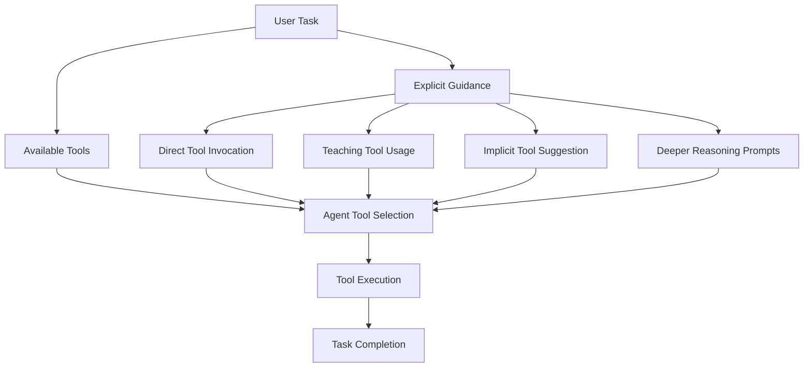

## Problem

AI agents equipped with multiple tools need clear guidance on when, why, and how to use these tools effectively. Simply having tools available doesn't guarantee they will be used appropriately for the task at hand.

## Solution

Guide the agent's tool selection and execution through explicit natural language instructions within the prompt. This includes:

-   **Direct Tool Invocation:** Telling the agent which tool to use for a specific part of a task
-   **Teaching Tool Usage:** Instructing the agent on how to learn about or use a new or custom tool
-   **Implicit Tool Suggestion:** Using phrases or shorthands that the agent learns to associate with specific tool sequences
-   **Encouraging Deeper Reasoning for Tool Use:** Adding phrases like "*think hard*" to prompt more careful consideration before acting

## Evidence

- **Evidence Grade:** `high`
- **Deliberation before action** improves tool selection success by 40-70% (Parisien et al., 2024)
- **Smaller models** benefit disproportionately more from explicit guidance
- **Production validation:** All major AI agent platforms implement some form of tool steering

## How to use it

- Use when agent success depends on reliable tool invocation, especially with custom tools or smaller models
- Structure guidance hierarchically: task categorization first, then tool selection rules
- Include decision frameworks (e.g., "if modifying existing code, use Edit; if creating new file, use Write")
- Add verification gates: always run build/test after code changes

## Trade-offs

* **Pros:** Improves execution success, reduces tool-call failures, enables context-preserving operations
* **Cons:** Introduces integration coupling, requires prompt maintenance as tool interfaces evolve, adds ~400-700 tokens per session overhead

## References

- Based on examples in "Mastering Claude Code: Boris Cherny's Guide & Cheatsheet"
- Yao, S., et al. (2022). [ReAct: Synergizing Reasoning and Acting in Language Models](https://arxiv.org/abs/2210.03629)
- Parisien, et al. (2024). [Deliberation Before Action](https://arxiv.org/abs/2403.05441)

---
