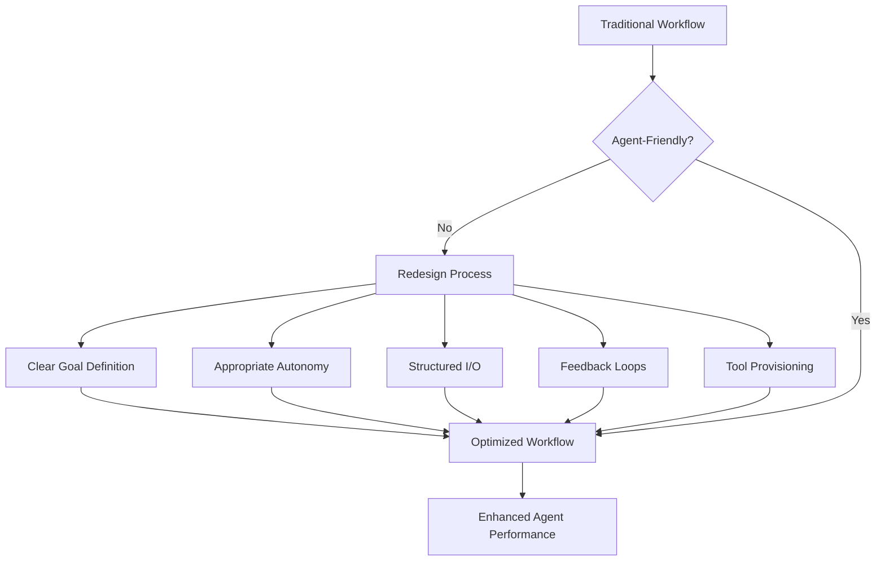

## Problem

Simply providing an AI agent with a task is often not enough for optimal performance. If workflows are too rigid, or if humans micromanage the agent's technical decisions, the agent may struggle or produce suboptimal results.

## Solution

Consciously design and adapt workflows to be "agent-friendly":

- **Clear Goal Definition:** Provide clear, high-level goals rather than overly prescriptive instructions
- **Appropriate Autonomy:** Grant the agent sufficient freedom to make its own implementation choices
- **Structured Input/Output:** Define clear interfaces for how the agent receives information and delivers results
- **Iterative Feedback Loops:** Establish mechanisms for intermediate work presentation and corrective feedback
- **Tool Provisioning:** Ensure the agent has access to the necessary tools and understanding
- **Planning-Execution Separation:** Separate planning from execution—never implement before reviewing and approving the plan
- **Clear Handoff Protocols:** For multi-agent systems, define explicit handoff criteria and context preservation

## How to use it

- Use this when humans and agents share ownership of work across handoffs.
- Start with clear interaction contracts for approvals, overrides, and escalation.
- **Start simple:** Begin with a single agent and limited scope; complexity increases exponentially as agents are added.
- **Design observability from day one:** Complete tracing is mandatory for debugging multi-step agent execution.
- **Deploy to observe:** Use production as the learning environment—iterate in days rather than perfecting for months.

## Trade-offs

* **Pros:** Creates clearer human-agent handoffs, better operational trust, and enables rapid iteration based on real-world feedback.
* **Cons:** Needs explicit process design and coordination across teams. Multi-agent systems can become exponentially complex.

## References

- Derived from insights in "How AI Agents Are Reshaping Creation"
- [OpenAI Swarm](https://github.com/openai/swarm) - Lightweight multi-agent orchestration with handoff patterns
- [Agent Engineering: Deploy to Observe](https://www.anthropic.com/index/agent-engineering)

---
